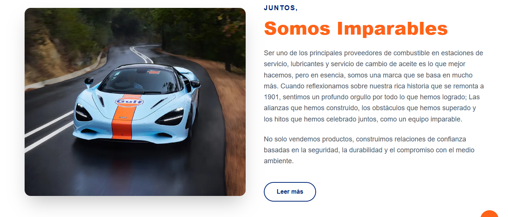
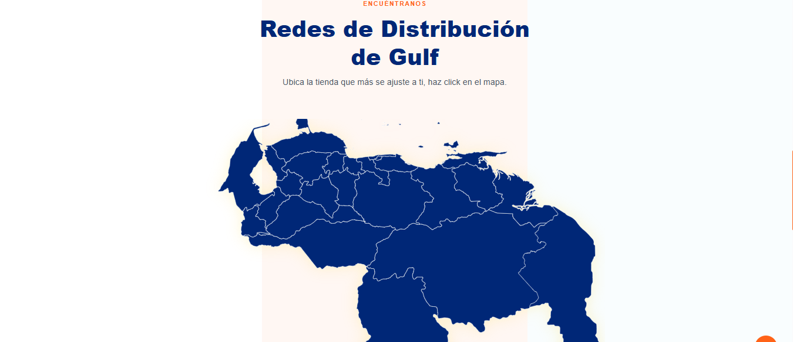
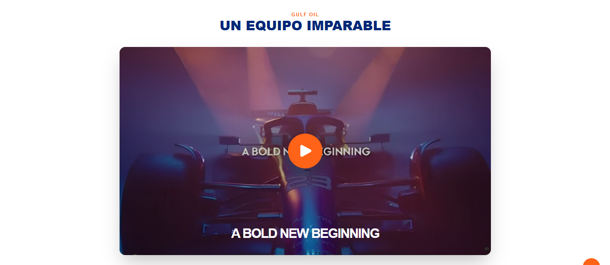
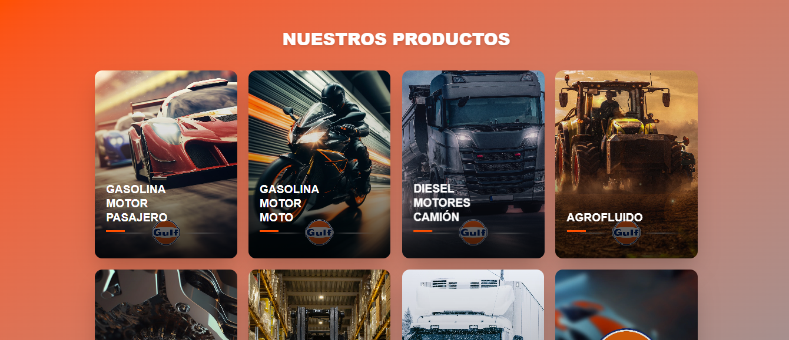
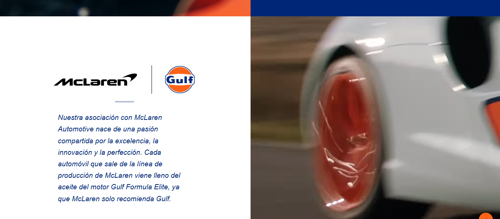
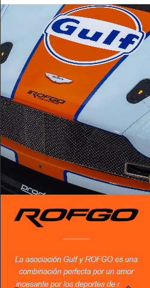
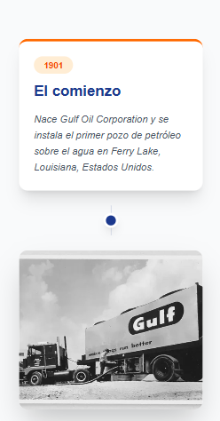
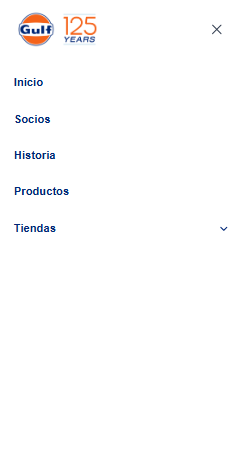
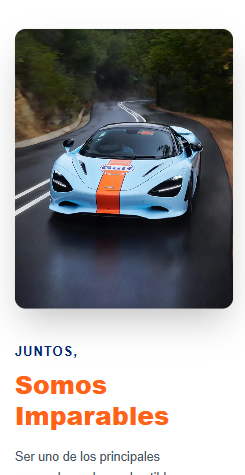
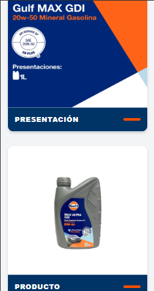

# 🏎️ Gulf Website - Next.js - Tailwind CSS

<p align="center">
  
</p>

<p align="center">
  
  
  
  
</p>

<p align="center">
  <a href="">🌐 Ver Demo en Vivo</a>
</p>

## 📝 Descripción

Este proyecto es una landing page moderna y de alto rendimiento desarrollada para Gulf, marca icónica y líder mundial en la fabricación de lubricantes y fluidos de alta tecnología. Construida con Next.js, la plataforma ofrece una experiencia de usuario fluida, rápida y optimizada para SEO, reflejando la calidad premium de la marca y su sólida presencia en el mercado venezolano a través de Lubricantes La Mundial.

La interfaz implementa la identidad visual clásica de Gulf (Azul y Naranja), diseñada para transmitir potencia, herencia automovilística y confianza. Incluye un catálogo interactivo de productos, un sistema de navegación por categorías y una sección avanzada de Red de Distribución, que permite a los usuarios localizar centros de servicio y puntos de venta autorizados de manera estratégica e intuitiva.

## 🚀 Problema que Resuelve

El desarrollo aborda y soluciona desafíos clave en la presencia digital de la marca:

- **Geolocalización Estratégica de Distribuidores:** Optimiza la búsqueda de puntos de venta en todo el país (Zulia, Caracas, Falcón, etc.) mediante menús categorizados y mapas interactivos, conectando directamente al consumidor con el producto físico.
- **Catálogo Digital Especializado:** Centraliza la información técnica de las diversas líneas de productos (Passenger Car, Heavy Duty, Motores fuera de borda), permitiendo a los usuarios consultar fichas técnicas y presentaciones de forma rápida, facilitando la toma de decisiones.
- **Rendimiento y Escalabilidad:** La migración a Next.js elimina los tiempos de carga prolongados, garantizando una navegación eficiente incluso en conexiones móviles limitadas, lo que mejora drásticamente la retención de usuarios y el posicionamiento orgánico (SEO).
- **Conectividad y Omnicanalidad:** Sincroniza la estrategia digital con la atención al cliente real, integrando accesos directos a redes sociales y canales de soporte, alineando la imagen global de Gulf con la operatividad local en tiempo real.

## 🛠️ Stack Tecnológico

- **Framework:** [Next.js](https://nextjs.org/) (React)
- **Estilos:** [Tailwind CSS](https://tailwindcss.com/)
- **Despliegue:** [Vercel](https://vercel.com/)

## 📸 Capturas de Pantalla

<p align="center">
  
  
  
  
  
  
  
  
  
  
</p>

## ⚙️ Instalación y Uso

Si deseas correr este proyecto localmente, sigue estos pasos:

1.  **Clonar el repositorio:**
    ```bash
    git clone [https://github.com/leoch17/gulf.git](https://github.com/leoch17/gulf.git)
    cd gulf
    ```
2.  **Instalar dependencias:**
    ```bash
    npm install
    # o
    yarn install
    # o
    pnpm install
    ```
3.  **Configurar variables de entorno (si aplica):**
    Crea un archivo `.env.local` basado en `.env.example`.
4.  **Correr el servidor de desarrollo:**
    ```bash
    npm run dev
    ```
5.  Abre [http://localhost:3000](http://localhost:3000) en tu navegador.

---

Desarrollado por [Leonardo Chourio](https://github.com/leoch17)

## Implementación en Vercel

La forma más sencilla de implementar tu aplicación Next.js es utilizar la [plataforma Vercel](https://vercel.com/new?utm_medium=default-template&filter=next.js&utm_source=create-next-app&utm_campaign=create-next-app-readme), creada por los desarrolladores de Next.js.

Consulte nuestra [documentación sobre la implementación de Next.js](https://nextjs.org/docs/app/building-your-application/deploying) para obtener más detalles.
